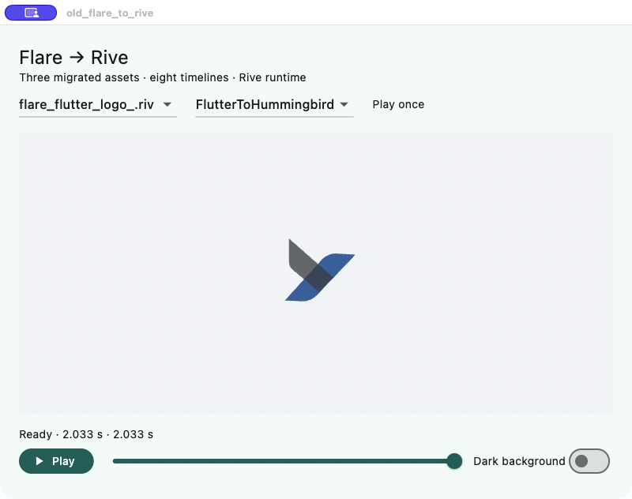

# OldFlareToRive

把 GSY 中三个旧版 `.flr` 矢量动画迁移为 `.riv`：保留图形、裁剪、层级、时间轴和动画名称。**默认 demo 只依赖 Rive，不需要 Flare、Rive CLI 或 Rive 账号就能播放仓库内的成品。**

转换链路是原始 Flare 二进制 → Python 解析 → RML → 官方 Rive CLI → `.riv`。没有用 PNG 序列、视频或手工画的近似图替代动画。

## 运行纯 Rive demo

验证环境：Flutter **3.47.2 / Dart 3.13.2**、Rive **0.14.11**、rive_native **0.1.11**、macOS arm64。仓库提供 macOS 工程。

```sh
cd demo
flutter pub get
flutter run -d macos
```

选择素材和动画，可以播放、暂停、拖动时间轴、切换背景。循环和单次播放遵循原文件；单次动画结束后再次点击播放会从头开始。中英文通过 Flutter `gen-l10n` 和 ARB 管理。



## 迁移成品

| 资源 | Flare 格式 | 动画 | 原始时长 / 播放方式 |
|---|---|---|---|
| [loading_world_now.riv](demo/assets/loading_world_now.riv) | v21 | Earth Moving | 10 s / 循环 |
| [Space-Demo.riv](demo/assets/Space-Demo.riv) | v18 | idle comet、idle、loading、success、pull | 4.033333、1.4、1.4、0.85、1.4 s / 循环 |
| [flare_flutter_logo_.riv](demo/assets/flare_flutter_logo_.riv) | v21 | Placeholder、FlutterToHummingbird | 1.5、2.033333 s / 单次 |

每个时间轴有同名 State Machine，便于通过标准 Rive 组件播放。默认 State Machine 是该素材的第一段动画。Logo 的圆角 morph 使用更细的整数时间格表示曲线，时间轴 fps 变为 61440，**实际时长、关键时刻和播放速度不变**。

GSY 已使用 `loading_world_now.riv` 驱动真实下拉刷新，保留原来的进度曲线和刷新时 2 倍速播放；生产工程移除了 `flare_flutter` 和旧控制器。另外两个素材在 GSY 原本没有运行入口，已替换成 `.riv` 资源，没有新增无关页面。

## 重新转换

只运行 demo 可以跳过本节。重建需要 Python 3 和[官方 Rive CLI](https://rive.app/docs/cli/getting-started)，本次使用 **1.0.2**。

```sh
python3 -m unittest -v test_conversion
python3 build.py --rive /path/to/rive
```

`build.py` 按 `assets.json` 处理三个原文件，重新生成 `projects/*/scene.rml`、解码报告 `source.json`，执行 CLI verify、inspect、build，最后同步两个 demo 的资源和 manifest。源文件在 `sources/`，产物 SHA-256 在 [evidence/artifact-hashes.json](evidence/artifact-hashes.json)。

CLI 1.0.2 的本地 `--verify`、`inspect`、`--once` 在本次实测中不要求登录或付款。此事实不等于承诺所有编辑器导出、团队服务或未来版本免费；[编辑器定价](https://rive.app/pricing)单独列出了导出所属套餐。已附成品的运行与 CLI 无关。

## 对比验证（可选，独立依赖）

`validation/flare_compare` 是迁移时的原版对照工具；只有主动进入该工程才会依赖 `validation/vendor/flare_flutter`。`demo/` 与 GSY 的依赖树都没有 Flare。

```sh
cd validation/flare_compare
flutter pub get
flutter run -d macos --dart-define=EVIDENCE_DIR=/absolute/path/to/frames
```

在界面点击“导出对比帧”。然后从仓库根目录分析某一动画目录：

```sh
python3 -m pip install -r validation/requirements.txt
python3 compare_frames.py /absolute/path/to/frames/flutter_logo/FlutterToHummingbird
```

两个真实运行库接收同一时间，使用相同画布尺寸和背景；同时检查直接定位时间轴、State Machine 顺序推进、循环/单次结束。原版绘制不读取转换器生成的 RML。对比工具包含历史格式兼容修复，原因和上游依据见 [迁移过程](docs/MIGRATION.md) 和 [第三方说明](THIRD_PARTY.md)。

## 验证结论与边界

- 三个 RML 均通过官方 CLI 检查；13 项转换回归测试通过。
- 8 段动画在原版 / Rive 对比工程中导出，共 406 对运行帧；纯 Rive demo 另做了全部时间轴切换、播放和单次重播检查。
- GSY 已完成 Pixel Fold 折叠 / 展开两种姿态的真实下拉刷新验证，Dart MCP 无异常；Android release APK 构建成功，包内不含 FLR。
- 地球通过既定严格像素阈值。**Space 和 Logo 未通过该严格阈值**：保留了颜色量化、透明边缘和抗锯齿差异，没有修改阈值来标记通过。
- Logo 的圆角 morph 按原 Flare 几何展开，并做自适应细分；0.001 画板单位是每段内部若干采样点的误差判据，不是连续时间全域误差的数学证明。
- 本项目针对这三个文件实际用到的格式子集，不是通用 `.flr` 导入器。不支持的组件或属性会明确报错。

详细数值、图片和验证方法见 [VALIDATION.md](docs/VALIDATION.md)。完整原始帧留在本地导出目录，Git 提交对比图、逐帧报告、采样表和哈希，避免把可重新生成的 130 MB 帧序列放进仓库。

## 目录

```text
sources/                       原始三个 .flr
projects/                      生成的 RML、解码数据和 CLI 配置
demo/                          默认纯 Rive Flutter demo
validation/flare_compare/      可选的双运行库对比工程
validation/vendor/flare_flutter/  对比专用旧运行库与 MIT 许可
convert_flare.py, geometry.py   严格解析、映射、圆角动画转换
build.py, test_conversion.py    构建与回归验证
compare_frames.py, evidence/    像素测量与真实运行证据
docs/                          迁移过程、验证结论
```

代码许可见 [LICENSE](LICENSE)，旧运行库及原始素材的来源、历史修改见 [THIRD_PARTY.md](THIRD_PARTY.md)。
